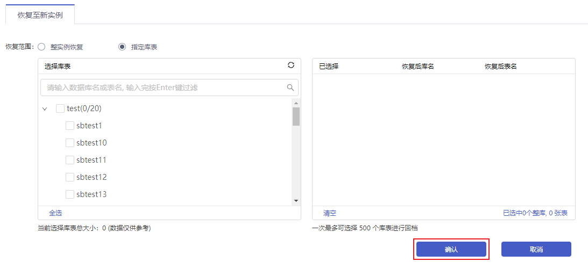

数据恢复范围支持 **整实例恢复** 与 **指定库表恢复**，您可以选择 **按备份集** 或 **按时间点** 的恢复方式来实现数据回档，回档基于数据备份 + 日志备份（binlog）回档至 7 天内任意时间。备份数据将会恢复到新实例上，原实例不受影响。

> **注意**：
>
> - 回档功能与自动备份设置的备份周期时间和保留天数相关联，提供基于保留天数下且备份周期时间内数据备份 + 日志备份（binlog）的回档，日志备份默认保留 7 天。备份周期设置详情请参见 [备份数据库](./00.备份数据库.md)。
> - 为保证数据安全，自动备份设置的备份周期请设置为一周至少备份两次 MySQL。 例如：您设置的备份周期为周一、周四，备份保留天数为 7 天，则可选回档至保留天数内的任意一天。

## 操作步骤

1. 进入 [云数据库 MySQL 控制台](https://console.capitalonline.net/dbinstances)，点击实例的名称进入到实例管理页面，点击 **备份恢复** 查看备份列表，或从更多操作中选择 **备份恢复** 进入。

2. 在备份恢复页面，点击 **数据恢复**。

   

3. 在恢复实例页面，选择恢复范围，支持整实例恢复与指定库表恢复。

   + 选择整实例恢复，点击 **确认** 进入恢复克隆页面。

     

   + 选择指定库表，需选择需要恢复的库表，确认无误后，点击 **确认** 进入恢复克隆页面。

     

4. 在恢复克隆页面中，选择恢复方式，支持按备份集与按时间点恢复，根据业务需求选择各配置项，检查无误后，点击 **创建**。

   

   > **注意**：
   >
   > + 按备份集恢复，实例必须存在至少一个备份集，若无备份集可选择按时间点恢复
   > + 克隆实例需要与原实例在同一内网网段下
   > + 克隆实例存储空间大小需要大于等于原实例存储空间大小
   > + 克隆实例不支持批量创建
   > + 当实例名称选择创建后设置时，克隆实例名称为：原实例名称+_bak+日期时间

5. 创建成功后页面会跳转至实例列表页，等待克隆实例的状态变为运行中时，即可使用该实例。

   > **注意**：
   >
   > 克隆出的新实例将正常计费，价格详情参见 [计费概述](./../../03.购买指南/00.计费概述.md)。

## 常见问题

### 1.我需要频率更高的备份该怎么做？

目前 MySQL 备份为一天备份一次，如需更高频率的备份，可通过 OpenAPI 定时备份。详情参见 [创建云数据库MySQL备份](./../../08.API文档/04.备份相关接口/00.创建云数据库MySQL备份.md)。
