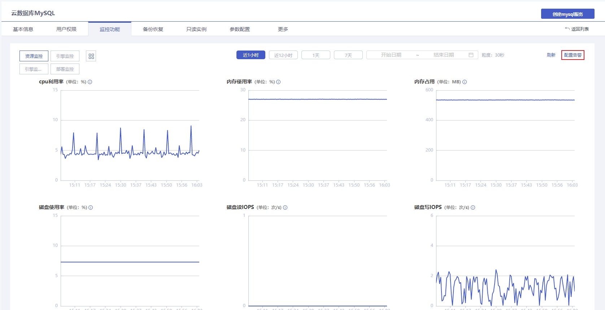
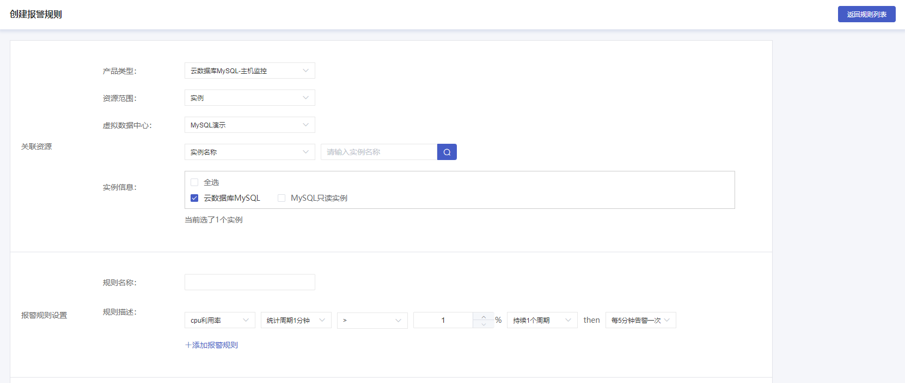

## 报警功能

### 使用场景

您可以创建报警策略，用于在云数据库 MySQL 状态改变时触发报警并发送通知。创建的报警会根据一段时间内的监控指标，对比设置的阈值做出判断是否需要触发通知。
云数据库 MySQL 实例状态发生改变触发报警后，您可以及时进行相应的预防或补救措施。因此，合理地创建报警策略能够帮助您提高应用程序的健壮性和可靠性。
当您需要针对云数据库 MySQL 的某个状态发送报警时，需要先创建报警策略。报警策略包括关联资源、报警规则和通知方式三个组成部分。每个报警策略是一系列报警规则的集合，报警规则是“或”关系，即一个条件满足，就会发送报警。报警将发送至联系人组内的所有人，您在接收到报警后可以及时查看并采取相应措施。

### 前置条件

您已成功创建 MySQL 实例，实例状态为运行中。创建实例步骤详情参见 [创建实例](./../../04.操作指南/02.管理实例/00.创建实例.md)。

### 操作步骤

1. 进入 [云数据库 MySQL 控制台](https://console.capitalonline.net/dbinstances)，点击实例的名称进入到实例管理页面，点击 **监控功能** 查看实例监控信息，或从更多操作中选择 **监控功能** 进入。

2. 在监控功能页面，点击右上角 **配置报警**。

   

3. 在报警服务页面，选择左侧导航中 **报警规则**，点击右上角 **创建报警规则**。

   

4. 在创建报警规则页面选择云数据库 MySQL 的报警类型，当前 MySQL 的报警规则产品类型分为主机监控、备机监控和基础版监控，根据您的需求创建报警规则。

   

5. 选择您的资源范围，云数据库 MySQL 报警规则支持全部资源与指定实例，选择完成后即可配置报警规则。

   

6. 更多云数据库 MySQL 监控指标介绍，详情参见 [报警指标说明](./03.报警指标说明.md)。
