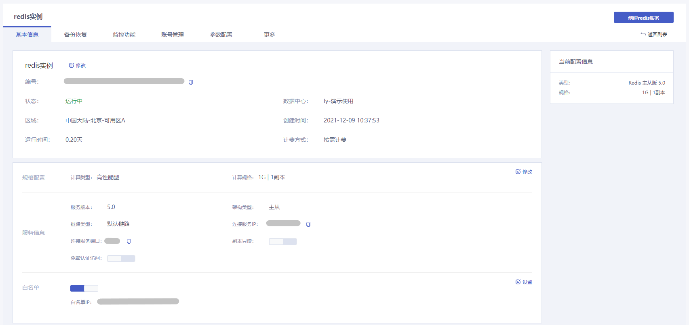

使用云数据库 Redis 过程中，可能碰到访问实例、维护实例和数据备份与恢复等相关问题。本文将为您介绍云数据库 Redis 实例使用过程中的常用操作，帮助您轻松管理云数据库Redis。

#### 实例列表页

#### 实例管理页面

您可以在数据库服务列表页通过点击**Redis实例名称**进入实例管理页，或点击实例后方的**操作项**对实例进行相关管理操作。

| 功能名称   | 功能说明                                                     |
| ---------- | ------------------------------------------------------------ |
| 服务开通   | 创建Redis实例，详情参见[创建Redis实例](./../03.快速入门/00.创建Redis实例.md)。 |
| 连接实例   | 多种连接方式，详情参见[连接实例](./../04.操作指南/02.连接实例/00.通过redis-cli连接.md)。 |
| 基本信息   | 显示当前Redis实例的基本信息内容，点击实例名称后面的**修改**按钮可以修改实例名称。 |
| 规格配置   | 修改Redis实例的计算规格，详情参见[调整配置](./../04.操作指南/01.管理实例/00.变更配置.md)。 |
| 清空实例   | 清空当前Redis实例的所有数据，详情参见[清空实例](./../04.操作指南/01.管理实例/02.清空实例.md)。 |
| 终止实例   | 终止Redis实例，详情参见[终止实例](./../04.操作指南/01.管理实例/03.终止实例.md)。 |
| 销毁实例   | 彻底删除Redis实例，详情参见[销毁实例](./../04.操作指南/01.管理实例/04.销毁实例.md)。 |
| 网络与安全 | 通过实例的白名单机制，控制云数据库Redis的网络访问，保障云数据库Redis的访问安全。详情参见[网络与安全](./../04.操作指南/03.网络与安全.md)。 |
| 参数配置   | 对Redis实例的多个参数进行修改配置，详情参见[参数配置](./../04.操作指南/07.参数配置.md)。 |
| 备份与恢复 | 提供Redis实例的数据备份功能和恢复功能，提供手动备份、自动备份两种方式，支持根据业务需要调整备份策略，详情参见[备份数据](./../04.操作指南/04.备份与恢复/00.备份数据.md)和[恢复数据](./../04.操作指南/04.备份与恢复/01.恢复数据.md)。 |
| 监控告警   | 查看当前Redis实例的资源使用情况、性能等方面的核心指标，详情参见[监控功能](./../04.操作指南/05.监控告警/00.监控功能)和[告警功能](./../04.操作指南/05.监控告警/02.告警功能)。 |
| 账号与密码 | 管理用于访问Redis实例的多个账号，支持变更权限和密码，详情参见[账号与密码](./../04.操作指南/06.账号与密码/00.创建与管理账号)。 |
| 标签管理   | 给实例添加标签方便分类管理，详情参见[标签管理](./../04.操作指南/09.标签管理.md)。 |

