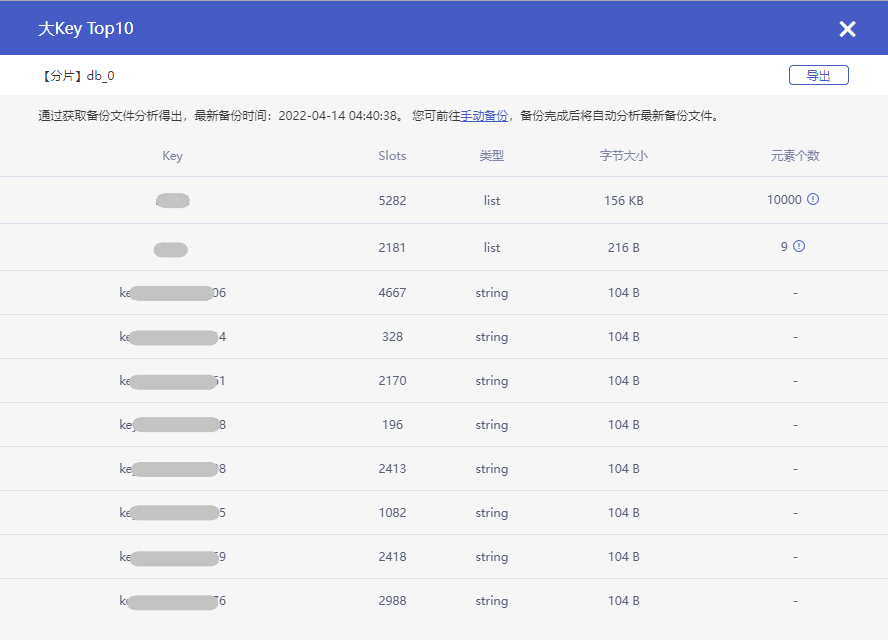
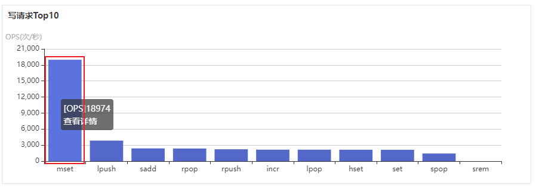
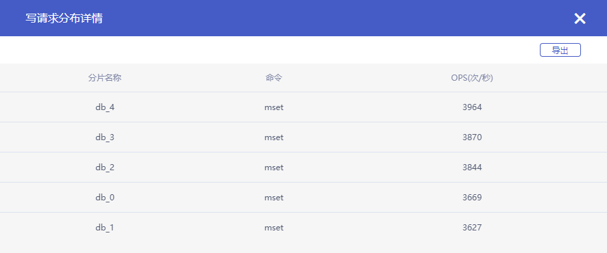
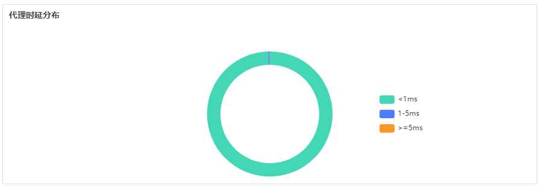
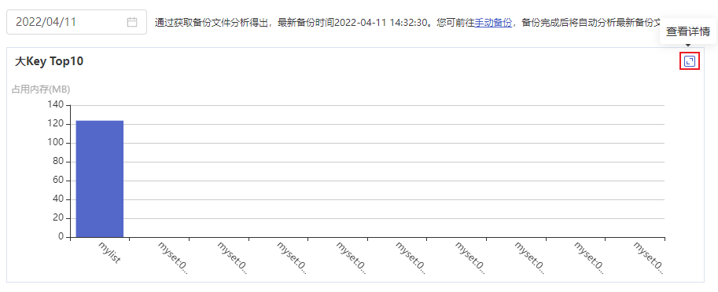

## 操作场景

云数据库Redis通过监控概览可以查看业务读写请求、代理执行时延和大Key的统计分析结果。可以帮助您及时掌握实例的整体运行状况，快速发现潜在隐患，为实例优化提供依据，避免因使用不当造成的大面积故障。

## 操作步骤

1. 登录[云数据库Redis控制台](https://console.capitalonline.net/dbinstances)，点击**实例名称**进入到实例管理页面。
2. 点击**监控功能**，选择**监控概览**，进入监控概览页面，可概览实例监控的统计分析结果。

> 说明：
>
> - 社区主从版监控概览支持查看：读请求Top10、写请求Top10、代理时延分布、大Key Top10、Key大小分布。
> - 社区集群版监控概览支持查看：分片概览、读请求Top10、写请求Top10、代理时延分布、大Key Top10、Key大小分布。

- **分片概览**：Redis集群展示各分片的基本属性和实时使用情况。详细信息包括：
  
  - Slots：当前分片所分配的槽。
  
  - CPU使用率：当前分片实时的CPU使用率。
  
  - 已使用内存：当前分片实时的内存使用量和内存使用率，已使用内存包含数据和缓存部分。
  
  - Key数量：当前分片中已存储的Key总个数。
  
  - 读写请求：当前分片实时的读请求和写请求的执行次数，读写请求分类请参见[命令分类](./02.监控指标说明.md#命令分类)。
  
  
  
  - **分片大Key Top10**：点击Key数量后面的**查看Top10**，展示当前分片中占用内存量前10的大Key。

  > 说明：
  >
  > 大Key通过自动分析备份文件得出。如果您想要最新的大Key分析结果，可先进行[手动备份](./../../05.操作指南/05.备份与恢复/00.备份数据.md)，备份完成后将自动分析大Key（分析时间与备份文件大小相关）。
  
  
  
  - **分片读写请求Top10**：点击读写请求后面的**查看Top10**，实时展示当前分片中执行次数前10的命令。
  
  
  
- **读请求Top10**：展示Redis实例读请求操作次数前10的命令。

  > 说明：
  >
  > 读请求分类请参见[命令分类](./02.监控指标说明.md#命令分类)。

  
  
  - **读请求分布详情**：点击统计图中单个柱形数据，展示当前读请求在各个分片的分布情况。
  
  > 说明：
  >
  > 仅Redis集群版实例支持查看分布详情。
  
  
  
- **写请求Top10**：展示Redis实例写请求操作次数前10的命令。

  > 说明：
  >
  > 写请求分类请参见[命令分类](./02.监控指标说明.md#命令分类)。

  

  - **写请求分布详情**：点击统计图中单个柱形数据，展示当前写请求在各个分片的分布情况。

  > 说明：
  >
  > 仅Redis集群版实例支持查看分布详情。

  

- **代理时延分布**：展示Redis实例读写请求从代理到Redis的执行时延分布情况。

- **大Key Top10**：展示Redis实例中占用内存量前10的大Key。

  > 说明：
  >
  > 大Key通过自动分析备份文件得出。如果您想要最新的大Key分析结果，可先进行[手动备份](./../../05.操作指南/05.备份与恢复/00.备份数据.md)，备份完成后将自动分析大Key（分析时间与备份文件大小相关）。

  

  - **大Key Top10详情**：点击**查看详情**图标，展示大Key Top10的详细信息。

  

- **Key大小分布**：展示Redis实例中所有Key占用内存大小的分布情况。

  > 说明：
  >
  > Key大小分布通过自动分析备份文件得出。如果您想要最新的Key大小分布结果，可先进行[手动备份](./../../05.操作指南/05.备份与恢复/00.备份数据.md)，备份完成后将自动分析大Key（分析时间与备份文件大小相关）。

> 说明：
>
> 读请求Top10、写请求Top10和代理时延分布默认展示实时信息，您也可以根据需求选择查看近1天内某一时间段的历史信息。
>
> 大Key Top10和Key大小分布默认展示当天最新的分析结果，您也可以根据需求选择查看近7天内某一日期的历史信息。

## 常见问题

### 为什么Redis集群实例的分片中没有Key，已使用内存却不为0？

云数据库Redis为了维持自身数据结构，在创建成功后会自动生成一些数据库元信息，因此会占用少量存储容量，这是正常现象。

