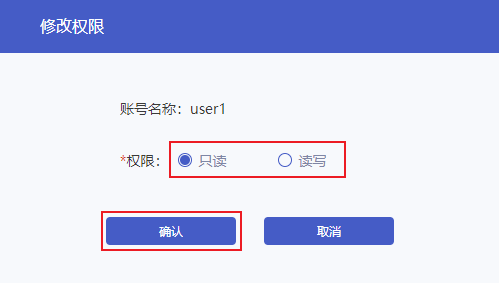
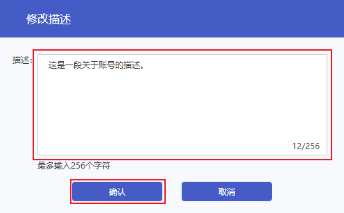

## 操作场景

云数据库Redis通过账号管理可以实现读写权限的灵活控制。 支持创建多个账号，支持对不同账号设置只读或读写权限，能够满足复杂业务场景中对业务权限的控制，最大限度地避免误操作带来的数据安全风险。

> 注意：
>
> - 如果当前实例的后台版本不支持此功能，您可以评估业务后联系客服进行升级。升级过程会发生连接闪断，建议选择业务低峰期操作。

### 账号分类

- 默认账号：只有密码的账号，密码认证访问Redis时，直接输入密码即可。例如：密码为`default123!@`，连接Redis时密码认证：`AUTH default123!@`。
- 普通账号：带有账号名的账号，密码认证访问Redis时，密码格式为`<user>:<password>`。例如：账号为`rwuser`，密码为`rwuser456@!`，连接Redis时密码认证：`AUTH reuser:rwuser456@!`。

## 操作步骤

### 创建账号

1. 登录[云数据库Redis控制台](https://console.capitalonline.net/dbinstances)，点击**实例名称**进入到实例管理页面。
2. 点击**账号管理**，进入账号管理页面。
3. 点击**创建账号**。

4. 在创建账号页面，设置账号信息。

> 说明：
>
> - 每个Redis实例最多支持创建10个普通账号。
> - 账号名称不能为Redis账号保留字：cds_root。
> - 账号权限支持设置为只读权限或读写权限。只读权限账号只有读取数据的权限，无修改数据的权限；读写权限账号拥有读数据和写数据的权限。

### 重置密码

1. 在账号列表中找到需要重置密码的账号，点击**重置密码**。

2. 在重置密码弹框中，重新设置账号的密码，点击**确认**。

> 注意：
>
> - 重置密码后，使用原账号密码访问Redis的连接会断开，需使用新密码重新认证后才能继续访问Redis。

### 修改权限

1. 在账号列表中找到需要修改权限的账号，点击**修改权限**。

> 说明：
>
> - 只有您自行创建的普通账号支持修改权限。默认账号具有读写权限，且不支持修改。

2. 在修改权限弹框中，选择当前账号所需权限，点击**确认**。

> 注意：
>
> - 修改权限后，使用原账号权限访问Redis的连接会断开，需重新连接后使用新权限访问Redis。

### 编辑描述

1. 在账号列表中找到需要设置描述的账号，点击按钮。

2. 在修改描述弹框中，编辑描述内容后，点击**确认**。

### 删除账号

1. 在账号列表中找到需要删除的账号，点击**删除**。

>  说明：
>
> - 只有您自行创建的普通账号可以删除，默认账号不允许删除。

2. 在删除提示框中确认操作后，点击**确定**。

> 注意：
>
> - 账号删除后，使用当前账号访问Redis的连接会断开，无法继续访问Redis。

## 后续操作

使用账号和密码连接云数据库Redis实例，详情参见[连接Redis实例](./../../04.快速入门/02.连接Redis实例.md)。