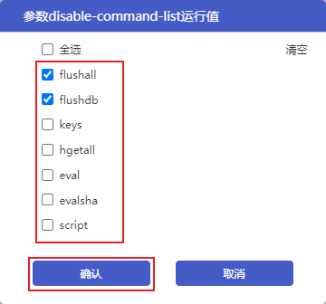
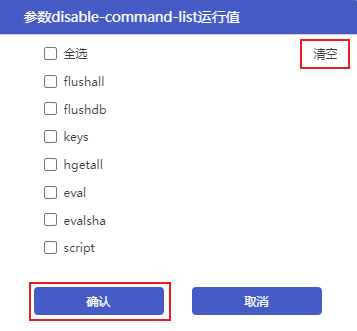

  ## 操作场景

Redis 部分命令的使用可能会导致服务不稳定、或者数据误删除，因此云数据库 Redis 提供了禁用部分命令的功能。您可以通过配置**disable-command-list**参数来禁用部分命令。

> 注意：
>
> 如果当前实例的后台版本不支持此功能，您可以评估业务后联系客服进行升级。升级过程会发生连接闪断，建议选择业务低峰期操作。

## 操作步骤

### 禁用命令

1. 登录[云数据库Redis控制台](https://console.capitalonline.net/dbinstances)，点击**实例名称**进入到实例管理页面。
2. 点击**参数配置**，进入参数配置页面。
3. 在可修改参数列表中找到**disable-command-list**参数，点击运行参数值后面的。

4. 在弹框中勾选需要禁用的命令，确认无误后，点击**确认**。

5. 点击**提交参数**。

> 说明：
>
> - 支持配置的禁用命令包括 flushall、flushdb、keys、hgetall、eval、evalsha、script，实例默认不禁用以上命令。
> - 设置的禁用命令参数提交完成后立即生效，禁用命令参数不会重启 Redis 服务。

### 取消禁用命令

1. 登录[云数据库Redis控制台](https://console.capitalonline.net/dbinstances)，点击**实例名称**进入到实例管理页面。
2. 点击**参数配置**，进入参数配置页面。
3. 在可修改参数列表中找到**disable-command-list**参数，点击运行参数值后面的。

4. 在弹框中对需要放开的命令取消勾选，如果需要放开全部命令，点击**清空**即可。确认无误后，点击**确认**。

5. 点击**提交参数**。

### 参数修改记录

您可以在**修改历史**页面，查看参数的修改历史记录，详情参见[查看修改历史](./../05.操作指南/08.参数配置.md#查看修改历史)。

