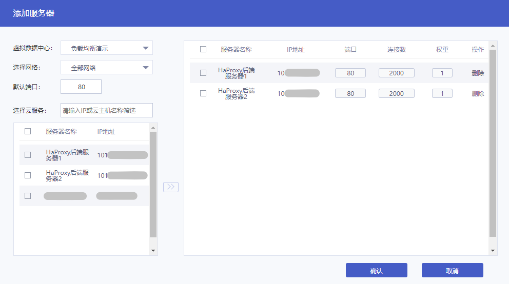

## 前置条件

您已创建成功负载均衡 HaProxy 实例，并正在创建或修改监听策略，创建负载均衡监听策略步骤详情参见 [创建负载均衡监听策略](../../04.操作指南/01.负载均衡监听策略/00.创建负载均衡监听策略.md)。

## 控制台配置

### 操作步骤

1. 进入策略配置详情页，在后端服务器设置中，点击 **添加服务器** 。

   

2. 在添加服务器弹窗中，选择虚拟数据中心，在虚拟中心中可选择已拥有的 VDC或其他非 VDC 的公网地址及域名。

   + 虚拟数据中心 ：默认为当前负载均衡 HaProxy 实例所在虚拟数据中心，下方列表显示全部云服务器，当选择其他虚拟数据中心时，尽支持选择具有公网的云服务器。
   + 其他地址/域名：当选择 其他地址/域名 时，支持在下方 **公网地址/域名** 处输入其他公网 IP 地址或域名。IP 或域名长度**限制为1-80字符**。

3. 当选择完服务器或其他公网 IP 或域名后，在右侧配置服务器监听配置，配置后点击 **确认** 关闭弹窗。

   <table width="95%" border="1" cellpadding="2" cellspacing="1">
   	<thead>
           <tr>
               <th align="left" width="15%">配置项</th>
               <th align="left" width="70%">说明</th>
           </tr>
   	</thead>
       <tbody>
           <tr>
               <td>端口</td>
               <td>设置服务器的监听端口，默认与负载均衡HaProxy监听端口一致，端口输入范围为1-65535，支持对一台服务器的多个端口进行监听</td>
           </tr>
           <tr>
               <td>连接数</td>
               <td>设置当前服务器最大连接数，默认为2000，当超出最大连接数后，请求将不再转发至当前服务器</td>
           </tr>
           <tr>
               <td>权重</td>
               <td>设置服务器权重，默认为1，权重输入范围为1-256（**注意**：权重数值越小越优先接受负载均衡分发的请求）</td>
           </tr>
   	</tbody>
   </table>

   

4. 添加后端服务器后，可在策略配置详情页继续添加服务器，或修改、删除后端服务器。

   
